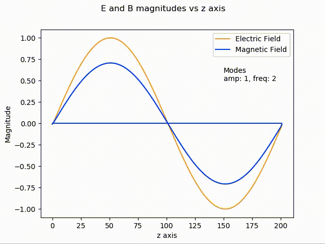

# Simulation of an Electromagnetic Wave Using Maxwell's Equations

## The Simulation
Our simulation will be of an infinitely long electromagnetic wave in a vacuum. A physical analog would be a perfectly steady stream of light travelling through space. We can either simulate monochromatic light of a single frequency or light composed of multiple frequencies.

The z axis will be the direction the light is moving, and we will watch this infite stream of light pass by. The amplitudes of the Electric field and Magnetic field will be displayed on the same axis, although it is important to remember the direction of the Electric field is in the x direction, and the Magnetic field in the y direction. [Here is a picture for clarity](https://en.wikipedia.org/wiki/Electromagnetic_radiation#/media/File:Onde_electromagnetique.svg)

The beauty of this simulation is how it takes Maxwell's Equations, and without [manipulating them](http://maxwells-equations.com/equations/wave.php) into the much simpler [wave equation](https://en.wikipedia.org/wiki/Wave_equation), simulate them and show that waves naturally emerge.

Because our simulation is of limited scale, to create an infinite wave the startpoint and endpoint of the simulation must have equal electric and magnetic fields (the algorithm takes the point to the right of zmax as 0, and the point to the left of 0 as zmax). This limits our starting condition to functions that are equal at z = 0 and z = zmax. Sine and Cosine are both periodic functions, and in this simulation we stick to just Sine functions.

## Prerequisites
[matplotlib.animation](https://matplotlib.org/users/installing.html)

## Usage
Command Line:

`python run.py`

`python run.py help`

`python run.py 1.,2 1.,4 0.5,6`

Each pair of numbers a,f represent... a - the amplitude of the initial sine wave, f - the number of peaks of the initial sine wave.

To keep the continuity E(0) = E(zmax), f must be an integer (the wave must fit exactly within the bounds).

Multiple inputs (like what is shown above) allow for multiple sine waves additively to make up the initial conditions of the simulation.

### maxwell_eq.py
#### Args
* `mu` (float) The constant mu in Maxwell's Equations
* `epsil` (float) The constant epsil in Maxwell's Equations, together with mu these set the "[speed of light](https://en.wikipedia.org/wiki/Speed_of_light#Propagation_of_light)" for our simulation
* `fact` (float) The stability factor for the algorithm. In essence it determines how far forward in time each timestep of the algorithm goes.
* `zmax` (int) The size of the simulated space, or the number of indices in the spatial array.
* `tmax` (int) The length of the simulation, or the number of indices in the time array.

#### Returns
* `Ex[i,n]` (numpy array) The Electric field magnitude at every point 0 -> i -> zmax for every timestep 0 -> n -> tmax
* `Bx[i,n]` (numpy array) The Magnetic field magnitude at every point 0 -> i -> zmax for every timestep 0 -> n -> tmax
### run.py

#### command line args
* `default` python run.py -- runs the simulation with one mode: Amplitude = 1, Frequency = 2
* `help` python run.py help -- prints out information about the command line usage
* `custom` python run.py &nbsp;a1,f1 &nbsp;a2,f2 &nbsp;a3,f3 &nbsp;... -- runs the simulation with multiple modes: a = amplitude, f = frequency

#### Output
Runs an animation of the simulation. The 'x axis' is the spatial axis (what we have so far called the z-axis because that is the standard notation for a plane wave). The 'y axis' is the magnitude of the Electric field and Magnetic field.

## Physical Meaning
For the derivation of the algorith, please refer to Derivation.pdf

### Electromagnetic Wave
An Electromagnetic wave is a "classical" (not quantum) model of light. It is a way of thinking of light as a disturbance in the Electromagnetic field propagating through space and time. The frequency (or its inverse: wavelength) of that light is represented by the second number "f" in the command line usage, for visible light this would represent color (blue is higher frequency than red).

### Maxwell's Equations
[Maxwell's Equations](https://en.wikipedia.org/wiki/Maxwell%27s_equations) model how Electric and Magnetic fields are created and interact with each other. In short: charge creates an Electric field. Moving charge creates a Magnetic field *and* an Electric field. A spatial change in the Electric field causes an evolution of the Magnetic field and vice versa.

### Electric and Magnetic Fields
An [Electric Field](https://en.wikipedia.org/wiki/Electric_field) does [work](https://en.wikipedia.org/wiki/Work_(physics)) on a charged particle (makes it move). The amplitude of that field is how fast the particle is accelerated, the direction of that field is what direction the particle is accelerated.

A [Magnetic Field](https://en.wikipedia.org/wiki/Magnetic_field) does no [work](https://en.wikipedia.org/wiki/Work_(physics)), it only deflects a charged particle. If the magnetic field is in the y direction (as in our simulation) and a charged particle is moving in the z direction, the particle will be deflected towards the x direction (By the [cross product](https://en.wikipedia.org/wiki/Cross_product)).

Therefore an Electromagnetic Wave has the ability to affect a charged particle, such as an electron. This is consistent with the way light interacts with charged particles. For example a photon hitting an atom often will raise the energy level of an electron, which then jumps to an outer shell, before returning back down to a lower shell and [emitting a new photon](https://en.wikipedia.org/wiki/Spontaneous_emission#/media/File:Spontaneousemission.png).

In quantum mechanics these jumps are between 'quantized' levels. The same jump means the same emitted photon. This consistency is [how astrophysicists determine what faraway stars are made of](https://en.wikipedia.org/wiki/Emission_spectrum)

